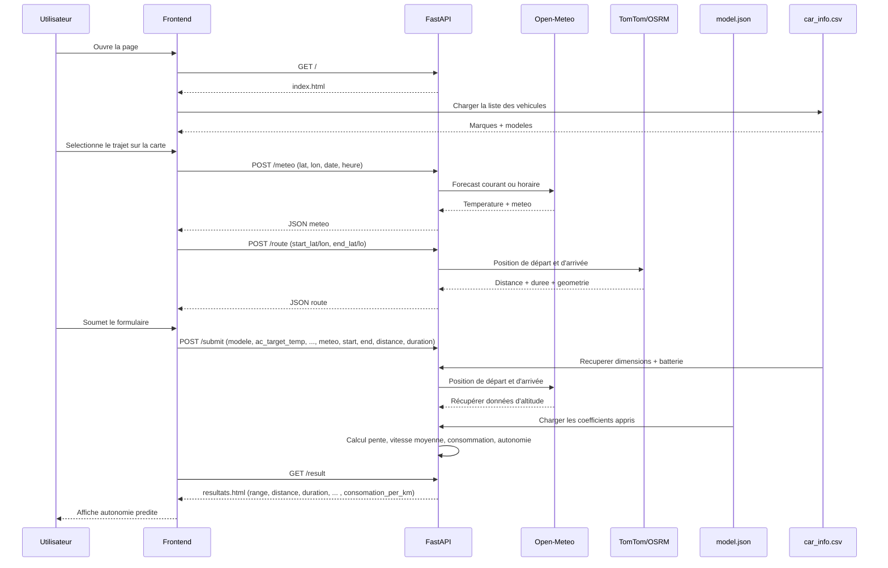
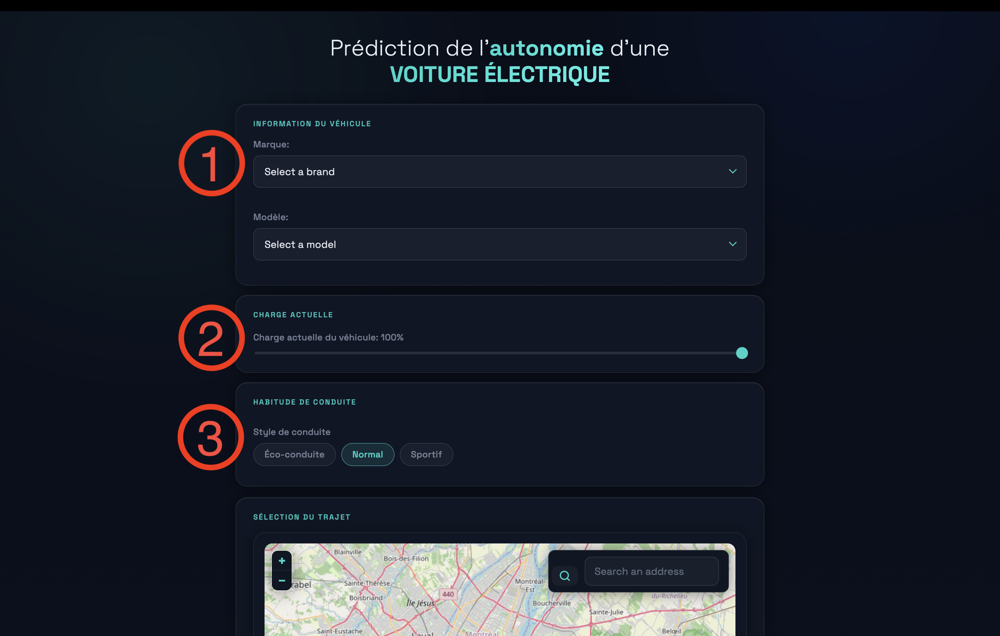
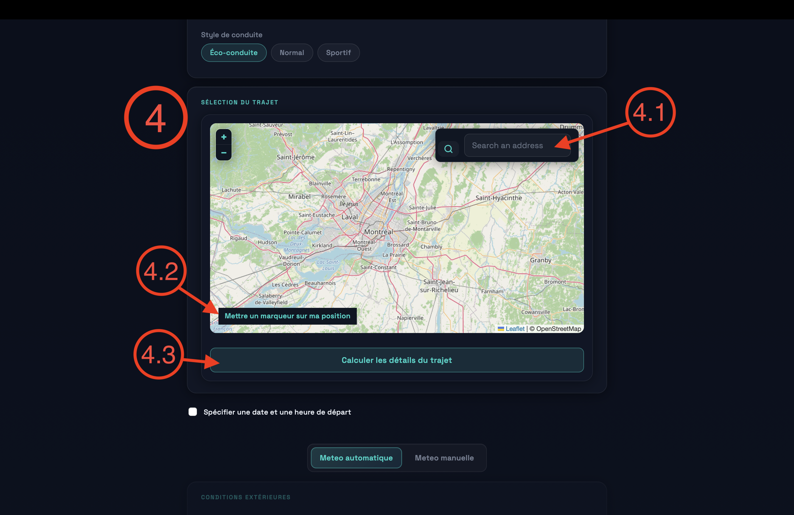
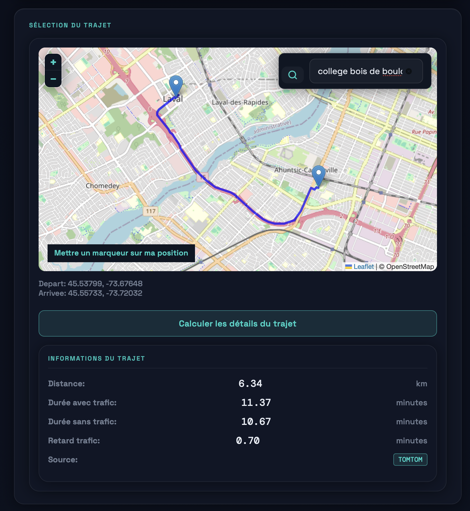
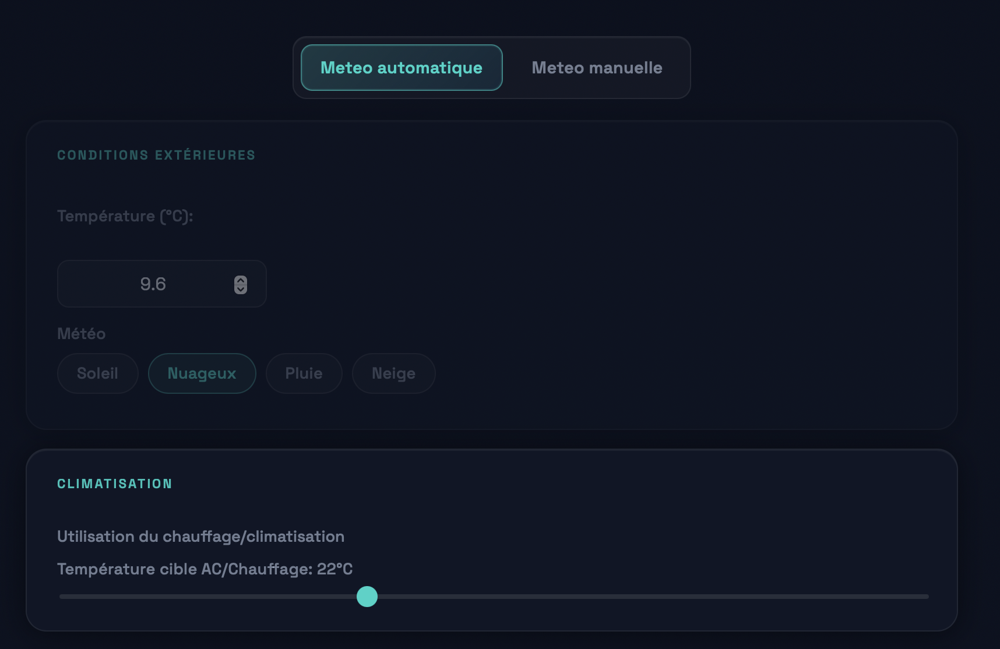
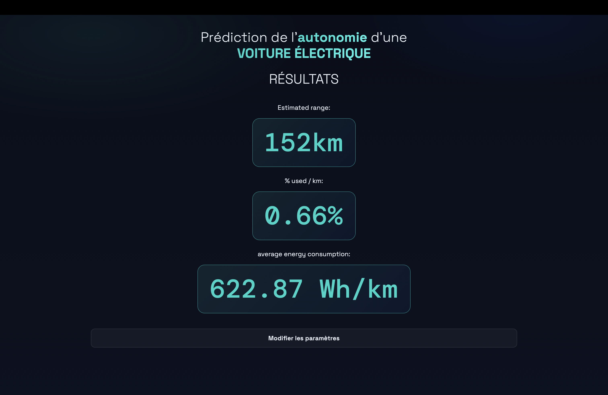

# Prédiction de l'autonomie des voitures électriques
Lien du dépôt github: https://github.com/AlexandreCabana/EVAIAutonomyPredictor#pr%C3%A9diction-de-lautonomie-des-voitures-%C3%A9lectriques
<!-- TOC -->
* [Prédiction de l'autonomie des voitures électriques](#prédiction-de-lautonomie-des-voitures-électriques)
  * [Description du projet](#description-du-projet)
    * [L'équipe](#léquipe)
    * [Idée](#idée)
    * [Utilité](#utilité)
    * [Inovation](#inovation)
    * [Cas d'utilisation](#cas-dutilisation)
    * [Public cible](#public-cible)
    * [Lien avec autre matière](#lien-avec-autre-matière)
  * [Fonctionemment de l'application](#fonctionemment-de-lapplication)
    * [Source de donnée et transformation](#source-de-donnée-et-transformation)
      * [Kagle](#kagle)
      * [VicomTech](#vicomtech)
      * [VEDElectrique](#vedelectrique)
      * [Calcul de la pente lorsque l'info est manquante](#calcul-de-la-pente-lorsque-linfo-est-manquante)
    * [AI sur des données suivant une somme de fonction polynomiale](#ai-sur-des-données-suivant-une-somme-de-fonction-polynomiale)
      * [Base de l'optimisation par l'IA](#base-de-loptimisation-par-lia)
      * [Graphique de l'erreur en fonction du nombre d'iteration](#graphique-de-lerreur-en-fonction-du-nombre-diteration)
        * [Calcul de l'erreur](#calcul-de-lerreur)
        * [Optimisation et ligne continue](#optimisation-et-ligne-continue)
      * [Test sur jeux de donnée aléatoire](#test-sur-jeux-de-donnée-aléatoire)
          * [Exemple 1](#exemple-1)
        * [Graphique de l'impact de chacun des facteurs par rapport aux données expérimental](#graphique-de-limpact-de-chacun-des-facteurs-par-rapport-aux-données-expérimental)
      * [Exécuter sur la carte graphique](#exécuter-sur-la-carte-graphique)
    * [IA sur les vraies données](#ia-sur-les-vraies-données)
      * [Impact des facteurs pris en compte pour prédire l'autonomie des véhicules électriques](#impact-des-facteurs-pris-en-compte-pour-prédire-lautonomie-des-véhicules-électriques)
      * [Overtrainning](#overtrainning)
    * [Siteweb](#siteweb)
      * [Qu’est-ce qu’une API?](#quest-ce-quune-api)
      * [Qu’est-ce que FastAPI?](#quest-ce-que-fastapi)
      * [Et un framework, c’est quoi?](#et-un-framework-cest-quoi)
      * [Diagramme de fonctionnement](#diagramme-de-fonctionnement)
  * [Création d’un projet fastAPI](#création-dun-projet-fastapi)
    * [Pour accéder au site:](#pour-accéder-au-site)
  * [Technologie utilisé](#technologie-utilisé)
  * [Tutoriel](#tutoriel)
  * [Analyse finale](#analyse-finale)
    * [Difficulté rencontrée](#difficulté-rencontrée)
      * [1. Les erreurs de logique](#1-les-erreurs-de-logique)
        * [A.Modèle cubique](#amodèle-cubique)
        * [B. Multiplication de fonction](#b-multiplication-de-fonction)
      * [2. Pas accès aux données au début](#2-pas-accès-aux-données-au-début)
      * [3. Difficulté à travailler sur l'IA à 2:](#3-difficulté-à-travailler-sur-lia-à-2-)
      * [4. Design fait par des LLMs:](#4-design-fait-par-des-llms-)
      * [5. Oubli de clear le cache](#5-oubli-de-clear-le-cache)
      * [6. A FAIRE](#6-a-faire)
  * [Analyse final](#analyse-final)
    * [Répartition des tâches](#répartition-des-tâches)
    * [Diagramme de Gant](#diagramme-de-gant)
    * [Respect de l'échéancier](#respect-de-léchéancier)
    * [Perspective](#perspective)
    * [Conclusion](#conclusion)
<!-- TOC -->
## Description du projet
### L'équipe
**Alexandre Cabana (AlexandreCabana):** Backend/IA

**Luca Ferrante Lalonde (LucaFL02):** Modèle et SiteWeb

**Thierry Leblanc (EatANapkin):** Traitement des données

**Guillaume Lavertu  (gliglo7):** SiteWeb
### Idée
Nous souhaitons créer une application qui permet à ses utilisateurs de prédire avec une IA la distance qu'ils peuvent 
parcourir avec l'énergie restante dans leur véhicule électrique.
### Utilité
Connaitre avec plus de précision l’autonomie d(distance maximale atteignable avec la charge restante) de son véhicule :

- Planifier ses déplacements
- Planifier ses charges
- Réduire sa consommation électrique
- Éviter des imprévus
- Fournir des données plus précises que celles des fabricants

Fonctionnalité :
- Carte pour sélectionner l’itinéraire prévu
- Prise en compte du traffic selon l’heure de départ
- Prise en compte des données météos (automatiquement ou manuellement)
- Entrainement du modèle par Machine Learning sur 586ko de données

Problème à résoudre : Les manufacturiers de véhicules électriques prédisent l’autonomie de leurs véhicules avec des tests sur dynamomètres. Les conditions de tests étant idéales, Les estimations sont souvent mauvaises dû aux impacts qu'à l’environnement sur la décharge lorsqu’on roule sur de vraies routes (vent, température, chauffage, etc.)

Solution : Prédire l’autonomie avec un modèle de machine learning qui est entrainé avec des données de trajets réels.

### Cas d'utilisation
1. Un utilisateur de VÉ veut connaitre avec une meilleure précision son range pour planifier ses déplacements
2. Un manufacturier de VÉ intègre notre app à ses véhicules pour offrir une meilleure prédiction du range à ses clients

### Public cible
Toutes les personnes qui ont accès à un véhicule électrique ou qui souhaitent acheter des véhicules électriques

### Lien avec autre matière
Maths et informatique : Machine learning, analyse de données

Physique : Paramètres du modèle modifiés par des fonctions physiques pour des prédictions plus précises.
Certains calculs basés sur la physique pour : Distance, altitude, énergie du chauffage/climatisation, énergie et autonomie

## Fonctionnement de l'application
Pour avoir un produit final, il y a trois sections importantes. La première partie est la transformation des données. La deuxième partie est l’entrainement de l’intelligence artificielle pour avoir une fonction mathématique qui prédit l’autonomie. Ensuite, il y a la partie du site-web qui permet à l’utilisateur d’utiliser la fonction mathématique.
### Source de donnée et transformation
Tous les fichiers de cette section sont dans le répertoire transformation de donnée
#### Kagle
Ce premier dataset était le plus riche en données puisqu'il offrait plusieurs trips pour chaque voiture pour arriver à un total de 5000 trips différents. Le dataset était également déjà regroupé par trip ce qui a sauvé beaucoup de temps dans le tri des données pertinentes. 
#### VicomTech
Cette deuxième source de donnée regroupe 29 trips avec deux voitures différentes pour obtenir 58 trips au total. Ce dataset était regroupé par timestamp avec des données correspondantes. Pour obtenir une meilleure vue d'ensemble, il a fallu donc regrouper le dataset selon chaque trip_id et faire une analyse statistique pour sortir les données pertinentes. 
#### VEDElectrique
Comme VicomTech, ce dataset était regroupé par timestamps, mais il comportait également beaucoup de données sur des véhicules hybrides ou des véhicules à gaz. Il a donc fallu garder seulement les véhicules exclusivement électriques. Il n'en comportait que 3 et seulement 2 des 3 ont enregistré des données utilisables. Ce qui fait de cette source de donnée la moins riche en donnée.

Les sources des Datasets sont mentionnées dans la section [Technologie utilisé](#technologie-utilisé)

#### Calcul de la pente lorsque l'info est manquante
Pour les données provenant de VED et VicomTech, la pente en % nécessaire pour nos calculs de l'IA n'était pas donné. Ils donnaient cependant la longitude et lattitude en degrés. Il était donc possible d'utiliser l'API de OpenMeteo afin de trouver une altitude pour une lattitude et longitude donnée. Il suffisait ensuite de faire le calcul suivant pour trouver le slope en %.


$$S = \frac{10 \cdot \Delta A}{\sqrt{d^2- {\Delta A}^2}}$$

$\delta A$: variation d'altitude

d:distance parcourue
### AI sur des données suivant une somme de fonction polynomiale
Tous les fichiers de cette section sont dans le répertoire AIScript

#### Base de l'optimisation par l'IA
Notre IA optimise une fonction qui se définit par une somme de fonction polynomiale telle que 
$f(x,y,z)= f_1(x) + f_2(y) +  f_3(z)$ où $f_n$ est une fonction polynomiale et n fait partie des réelles.
Par exemple,
$$f(x,y,z)= \alpha_{x2} \cdot x ^2 + \alpha_{x1} \cdot x + \alpha_{x0}  + \alpha_{y1} \cdot y + \alpha_{y0} + \alpha_{z1} \cdot z + \alpha_{z0}$$ où $\alpha$ représente des facteurs. 

L'IA trouve les facteurs optimaux, souvent appelé « weight » en anglais, pour que la formule globale trouvée suive le plus possible les données dans notre jeu de donnée transformées. La library Pytorch est utilisée pour facilement faire une descente de gradient basé sur la dérivée. La première étape consite à définir une fonction qui calcul l'erreur en fonction des paramètres que le modèle prend. Ensuite, la deuxième étape est de calculer la dérivée partielle de chacun des paramètres par rapport à l'erreur. Ensuite, la dérivée est multiplié par un facteur habituellement constant que tu soustrais à l'erreur. Ainsi, l'erreur va être réduite. Le programme exécute ceci en boucle jusqu'à temp que l'erreur est minimal. Dans notre cas, on utilise l'optimiseur ADAM pour changer le facteur constant par une fonction qui dépend de la variation de l'erreur depuis la dernière fois. Ceci permet à notre programme d'optimiser plus vite. Dans le graphique suivant, vous pouvez constater l'évolution de l'erreur en fonction du nombre d'itérations d'une fonction parfaite.
Dans le graphique suivant, la fonction en mauve est l'erreur que nous optimisons à l'aide des dérivées partielles sur le paramètre x d'une fonction.


#### Graphique de l'erreur en fonction du nombre d'itérations
Ce type de graphique permet de suivre l'évolution de l'intelligence artificielle avec le temps. Il y a une constante dans le fichier de configuration que vous pouvez modifier afin de déterminer à quelle fréquence il sauvegarde et génère les graphiques.
Dans le graphique suivant, vous pouvez constater l'évolution de l'erreur en fonction du nombre d'itérations.\

##### Calcul de l'erreur
L'erreur est calculé avec la technique de l'erreur quadratique moyenne, soit
$$MSE = \frac{1}{N} \cdot \sum_{i=1}^{N} {(x_n- \tilde{x_n})^2} $$ où N représente le nombre d'éléments, $x_n$ 
représente la valeur théorique du n-ième élément et $\tilde{x_n}$ représente la valeur n-ième élément prédit.
##### Optimisation et ligne continue
Afin d'accélérer le programme, le programme ne génère pas le graphique de l'erreur en fonction du nombre d'itérations à chaque X iteration. Il y a une constante
au début du script python qui indique à quel intervalle dessiner le graphique. Lorsque le graphique ce fait, l'erreur est calculé. Par défaut, la constante est à 10 000. Pour avoir une ligne continue sur l'erreur, la librairie scipy avec la fonction interpolate qui fait une ligne qui passe par les points donnés.
#### Test sur jeux de donnée aléatoire
Pour tester notre intelligence artificielle rapidement et éfficacement, le code X génère un jeu de donnée aléatoire qui suit une fonction multivariable aléatoire de degré different.
###### Exemple 1
$$f(a,b,c,d,e,f) = a_3 \cdot a^3 + a_2 \cdot a^2 + a_1 \cdot a + a_0 + b_3 \cdot b^3 + b_2 \cdot b^2 + b_1 \cdot b + b_0 + c_2 \cdot c^2 + c_1 \cdot c + c_0 + d_2 \cdot d^2 + d_1 \cdot d + d_0 + e_1 \cdot e + e_0 + f_1 \cdot f + f_0$$
Lorsque le programme se lance, tous les paramètres sont définis aléatoirement. Après être optimisé, voici les résultats que nous avons obtenus. Dans ce graphique, vous pouvez constater la variation de chacun des paramètres par rapport à l'axe des Y.


##### Graphique de l'impact de chacun des facteurs par rapport aux données expérimental
Pour modéliser la fonction multivariable, nous ne pouvons pas faire de graphique 
traditionel, car le corp humain ne peut pas observer une fonction qui a plus que deux paramètres. Ainsi, il faut être ingénieux pour représenter une fonction à plus de variable avec des graphiques. 

En ayant une fonction de type  
$$f(x,y,z)= f_1(x) + f_2(y) +  f_3(z)$$\
Avec la formule suivante, on peut avoir l'effet du paramètre a sur la fonction\
$$f(x,y,z) - f_2(y)- f_3(z) = f_1(x)$$\
Avec la formule suivante, on peut avoir l'effet du paramètre b sur la fonction\
$$f(x,y,z) - f_1(x) - f_3(z) = f_2(y)$$\
Avec la formule suivante, on peut avoir l'effet du paramètre c sur la fonction\
$$f(x,y,z) - f_1(x) - f_2(y) = f_3(z)$$\
On peut ainsi généraliser ceci pour une fonction multivariable.\
$$f(n_1,n_2, ..., n_n) - \sum_{i=1}^{n} f_n(n_n) + f_a(n_a) = f_a(n_a)$$ où a est le paramètre à évaluer\
Ainsi, on peut représenter l'effet d'un paramètre sur la fonction globale.
L'inconvénient de cette technique est que les graphiques générés lorsque l'IA s'entraine sont moins représentatif comme vous pouvez le voir avec le graphique suivant :


Ceci se produit, car les prédictions des autres fonctions sont erronées.
Cependant, une fois entrainé, cette technique marche parfaitement et les graphiques sont cohérents.


#### Exécuter sur la carte graphique
Afin d'optimiser l'exécution du code, la librairie Pytorch doit être réinstallé pour une version compatible avec ta version de CUDA. Dans mon cas, j'ai installé la version 13.0.
Pour installer la version de pytorch, j'ai utilisé la commande : 
```bash
pip install torch --index-url https://download.pytorch.org/whl/cu130
```
### IA sur les vraies données
#### Impact des facteurs pris en compte pour prédire l'autonomie des véhicules électriques
Après avoir fait des recherches, nous avons déterminé telle relation pour estimer l'autonomie d'un véhicule électrique.
En premier lieu, voici une liste de définition
- E: Énergie consommée durant le trajet
- V: Vitesse
- S: Dénivelé moyen
- M: Masse du véhicule
- D: Distance parcourue
- $T_{ext}$: Température extérieure
- $T_{int}$: Température intérieure
- $f_n$ est une fonction de degré n
- $\alpha$ veut dire proportionnelle

$$E \hspace{0.5em} \alpha \hspace{0.5em} f_1(D) \cdot f_1(M) \cdot f_3(S)$$
$$E \hspace{0.5em} \alpha \hspace{0.5em} f_1(D) \cdot f_2(V) $$
$$E \hspace{0.5em} \alpha \hspace{0.5em} f_1(D) \cdot f_2(T_{ext} - T_{int})$$
#### Overtrainning
Normalement, sur un jeu de donnée aléatoire où toutes les données n'ont pas de bruit: le plus que le programme roule le mieux que c'est. Cependant, lorsque les données ont du bruit, l'IA va trop optimiser sur le jeu de donnée et ne plus être précis. Ainsi, il faut séparer les données en deux, soit une partie pour l'entrainement et une autre pour valider. Lorsque les données sont séparées, on calcule l'erreur sur la partie de validation et d'entrainement. Lorsque que le programme est surentrainé, l'erreur sur les données de validation montre en flèche comme qu'on peut le voir sur le graphique suivant.  \

On peut aussi calculer une erreur globale qui est une moyenne pondérée entre celle des données de validation et entrainement. Pour accéder au model optimale, on sauvegarde le model dans un fichier qui s'appelle model.json.


### Siteweb

#### Qu’est-ce qu’une API?
C’est tout simplement un intermédiaire qui permet à différentes applications de communiquer entre elles. Par exemple, il existe des API pour la météo où, dans l’URL, tu spécifies la position voulue, la date voulue, et l’API de météo va te renvoyer les informations de température et de précipitation pour cette localisation et date spécifique.
#### Qu’est-ce que FastAPI?
C’est un framework qui permet de créer des API de manière simple et efficace. Il est notamment utilisé par des géants du web comme Netflix.
#### Et un framework, c’est quoi?
Un framework est une structure de base pour construire un projet avec de nombreuse fonctionnalité. La grosse différence avec une librairie et que la manière de lancer le projet est souvent différent qu'un script standard. Dans notre cas, FastAPI permet de créer le backend d'un serveur en python.
#### Diagramme de fonctionnement
Voici le diagramme des requêtes que le site web fait

Référence intéressante: https://www.jetbrains.com/help/pycharm/fastapi-project.html#create-project

## Création d’un projet fastAPI

[//]: # (1&#41;	Installer PyCharm &#40;https://www.jetbrains.com/pycharm/&#41;)

[//]: # (2&#41;	Créer un nouveau projet)

[//]: # (3&#41;	Sélectionner FastAPI comme type de projet)

[//]: # ()
[//]: # (![My image]&#40;./images/tutoriel/projet_fastAPI.png&#41;)

[//]: # ()
[//]: # (4&#41;	Spécifier le nom de votre projet, son emplacement et si vous désirez créer un répertoire Git)

[//]: # (5&#41;	Cliquer sur Create)

[//]: # ()
[//]: # (À ce moment-là PyCharm va installer le framework de FastAPI et uvicorn &#40;un serveur web&#41;. Vous allez aussi voir apparaitre un fichier main.py qui contient du code de base pour la création d’API.)

[//]: # ()
[//]: # (![My image]&#40;./images/tutoriel/main_py.png&#41;)


### Pour accéder au site:
Si le site est actif, dirigez-vous sur : https://evaiautonomypredictor.onrender.com/
Sinon,
1) Importez notre projet dans PyCharm
2) Créez un environnement venv
    Pour s'y faire, vous devez ouvrir le terminal et être au root du projet (vous devriez y voir ```EVAIAutonomyPredictor %```). Ensuite, si vous n'avez pas encore d'environnement virtuel, faites la commande suivante: 
    ```bash
    python -m venv .venv
    ```
    Puis, activer cet environnement de la façon suivante si vous êtes sur _**Windows**_:
   
    ```bash
    .venv\Scripts\activate
    ```

    Sinon, si vous êtes sur **_macOS / Linux_**
    ```bash
    source .venv/bin/activate
    ```
   À présent, vous devrez voir un ```(.venv)``` dans votre terminal.
3) Installer les librairies requises :
    ```bash
    pip install -r requirements.txt
    ```
   ```bash
    pip install -r requirementsWebsite.txt
    ```
4) Exécutez  
```bash
python main.py 
```
5) Dirigez-vous sur http://127.0.0.1:8000 dans votre navigateur

### Utilisation du site web

1. #### Choix du véhicule
    Vous devez d'abord entrez le marque et le modèle de votre véhicule. De cette manière, le système peut prendre en compte des paramètres spécifiques à votre véhicule comme la capacité électrique.
2. #### Charge du véhicule
    Vous pouvez entrez la charge de votre véhicule.
3. #### Style de conduite
    Ici, vous pouvez spécifier votre style de conduite.
   * Éco-conduite : Vitesse réduite
   * Normal: Vitesse courante
   * Sport: Haute vitesse


4. #### Sélection du trajet
    Dans cette section vous pouvez personnaliser votre trajet. Le fonctionnement est très simple : vous devez placer deux points géographique et le meilleur itinéraire va être calculer automatiquement. Pour s'y faire vous avez trois façon de placer des points.\
   * Utiliser la barre de recherche (4.1)
   * Utiliser votre propre localisation (4.2)
   * Utiliser la carte interactive et cliquer sur la localisation\

    Lorsque vous êtes satisfait de votre trajet, vous pouvez cliquer sur _**Calculer les détails du trajet**_ (4.3)
    
    À ce moment-là, vous allez pouvoir voir des informations pertients concernant votre trajet
   * Distance
   * Durée (avec et sans traffic)
   * Retard causé par le traffic
5. #### Spécification de la date et de l'heure de départ
    
    Vous pouvez aussi spécifier la date et l'heure de départ. Cela permet d'obtenir la météo automatiquement pour une certaine date et heure.
6. #### Météo (mode auto/manuel)
    Vous pouvez décider de prendre les prévisions météos ou d'entrez vos propres conditions météos pour voir l'influence sur le résultat.
    
7. #### Climatisation
   Vous pouvez ajuster la climastisation de votre véhicule.
8. #### Résultats
    Lorsque vous êtes satisfait des paramètres entrées, vous pouvez cliquer sur envoyer au bas de la page et vous allez voir les résultats de la prédiction.
    
## Technologie utilisé
- **Technologies à utiliser** :
    - Language frontend: JavaScript (HTML et CSS)
    - Language backend: Python
    - Framework pour l’application: FastAPI
    - APIs:
        - OpenStreetMap (https://www.openstreetmap.org/)
        - TomTom (https://developer.tomtom.com/)
        - OpenMeteo (https://open-meteo.com/)
    - Bibliothèques FrontEnd:
        - Leaflet (https://leafletjs.com/)
        - PapaParse (https://www.papaparse.com/)
    - Bibliothèques Serveur:
        - uvicorn (https://uvicorn.dev/)
        - Starlette (https://starlette.dev/)
        - Pydantic (https://pydantic.dev/)
        - Pandas (https://pandas.pydata.org/)
        - NumPy (https://numpy.org/)
        - FastAPI(https://fastapi.tiangolo.com/)
        - Pathlib
        - Time
        - JSON
        - Csv
        - Requests
    - Bibliothèque pour entrainer l’IA:
        - Pytorch (https://pytorch.org/)
        - NumPy (https://numpy.org/)
        - SicPy (https://scipy.org/)
        - Matplotlib (https://matplotlib.org/)
        - Pandas (https://pandas.pydata.org/)
        - JSON
        - Math
    - Bases de données pour entrainer IA:
        - Kaggle (https://www.kaggle.com/datasets/ziya07/ev-energy-consumption-dataset)
        - VicomTech (https://github.com/Vicomtech/d-EVD_dual-Electric-Vehicle-Dataset)
        - VEDElectrique (https://github.com/gsoh/VED)
    - Version control: Git et Github

## Analyse finale
### Difficulté rencontrée
#### 1. Les erreurs de logique
##### A.Modèle cubique
La fonction cubique avait mal été définis. Ainsi, lorsque l'optimiseur faisait de l'optimist, elle ne fonctionnait pas. Au début, c'était définit par $f(x)=\alpha_3 \cdot x^3 + \alpha_2 \cdot x^2 + \alpha_3$
Ceci est érroné et devrait être $f(x)=\alpha_3 \cdot x^3 + \alpha_2 \cdot x^2 + \alpha_1$
Ceci est un problème simple, mais il a pris 3h à résoudre.
##### B. Multiplication de fonction
Pendant un moment, je n'arrivais pas à comprendre pourquoi le modèle était très imprécis. Après analyse et réflexion, ceci était dû au fait que si deux paramètres sont multipliées ensemble, toutes les combinaisons de degrés ne sont pas calculées. Par exemple, 
$$f_2(x) = \alpha_{x2} \cdot x^2 + \alpha_{x1} \cdot x + \alpha_{x0}$$
$$f_3(y) = \alpha_{y3} \cdot y^3 +\alpha_{y2} \cdot y^2 + \alpha_{y1} \cdot y + \alpha_{y0}$$
$$f(x,y) = f_2(x)) \cdot f_3(y) $$
$$f(x,y) = (\alpha_{x2} \cdot x^2 + \alpha_{x1} \cdot x + \alpha_{x0}) \cdot (\alpha_{y3} \cdot y^3 +\alpha_{y2} \cdot y^2 + \alpha_{y1} \cdot y + \alpha_{y0})$$
$$f(x, y)=\alpha_{x2} \cdot \alpha_{y3} \cdot x^2 \cdot y^3 + \alpha_{x2} \cdot \alpha_{y2} \cdot x^2 \cdot y^2 +
\alpha_{x2} \cdot \alpha_{y1} \cdot x^2 \cdot y +
\alpha_{x2} \cdot \alpha_{y0} \cdot x^2 +
\alpha_{x1} \cdot \alpha_{y3} \cdot x \cdot y^3 +
\alpha_{x1} \cdot \alpha_{y2} \cdot x \cdot y^2 +
\alpha_{x1} \cdot \alpha_{y1} \cdot x \cdot y +
\alpha_{x1} \cdot \alpha_{y0} \cdot x +
\alpha_{x0} \cdot \alpha_{y3} \cdot y^3 +
\alpha_{x0} \cdot \alpha_{y2} \cdot y^2 +
\alpha_{x0} \cdot \alpha_{y1} \cdot y +
\alpha_{x0} \cdot \alpha_{y0}$$

Au lieu de faire ça, mon code faisait
$$f(x,y) = \alpha_2 \cdot (xy)^2 + \alpha_1 \cdot xy + \alpha 2 $$

Ce n'est donc pas equivalent. J'ai donc fait que l'équivalence soit vraie.
#### 2. Pas accès aux données au début
Un problème que nous avons eu est que pour pratiquer une intelligence artificielle, il faut avoir des données. Cependant, il fallait transformer les données en premier. Pour résoudre ceci, nous avons créé un script qui génère des données aléatoires suivant une fonction multivariable de degré 1 à 3.
#### 3. Difficulté à travailler sur l'IA à 2: 
Après avoir modélisé le modèle, Alexandre et Luca devaient créer l'IA pour intégrer le modèle en Python. Travailler en peer-to-peer se révélait inefficace et une personne faisait plus de travail que l'autre. Nous avons donc décidé de laisser la conception de l'IA à Alexandre alors que Luca aidait Guillaume à concevoir le SiteWeb.

#### 4. Design fait par des LLMs: 
Nous avons décidé de rendre notre site plus beau en modifiant notre CSS avec Gemini et Claude. Cela a eu pour effet de ralentir notre progression sur le site dû aux hallucinations et bugs de cohérences causées par les LLMs. Nous aurions dû nous satisfaire d'un site moins esthétique, mais plus simple afin d'accélérer notre productivité sur des fonctionnalitées concrètes.
#### 5. Oubli de clear le cache
Un des problèmes qui est survenu à quelques reprises est celui de voir aucun changement lors qu'on modifie le code de l'interface graphique. Cela est dû au cache du navigateur. Pour résoudre le problème, il suffit seulement de clear le cache et de le désactiver. Cependant, lorsqu'on n'y pense pas, cela peut nous faire perdre un temps précieux.

#### 6. A FAIRE
## Analyse final


### Répartition des tâches
Voici précisément ce que chacun a fait
#### Guillaume
* Conception du Layout du SiteWeb
* Logique de sélection du véhicule
* Logique radio buttons (habitudes de conduite, type de météo)
* Sélection de la météo automatique/manuelle
* Calls de open-meteo
* Date de départ programmée
* Logique de demande de position
* Page Résultats
* Récupération des données de modele.json
* Calculs de l'autonomie
#### Luca
* Conception du modèle et choix des paramètres initiaux
* Logique des Sliders (Charge actuelle, climatisation)
* Estimation de l'énergie utilisée par la climatisation/chauffage
* Estimation de l'impact du style de conduite
* Intégration de la carte
* Logique des marqueurs sur la carte et de la ligne du trajet
* Calls TomTom et OpenStreetMap
* Barre de recherche
* Calculs de l'autonomie
#### Alexandre
* Choix des paramètres finaux
* Tests sur des fonctions parfaites
* Implémentation informatique du Machine Learning
* Modifications mathématiques pour améliorer la performance
* Utilisation de CUDA
* Analyse de données
#### Thierry
* Calculs du dénivelé moyen avec open-meteo
* Suppression des véhicules non-électriques dans les 3 datasets
* Suppression des paramètres inutiles dans les 3 datasets
* Combinaisons des 3 datasets en un csv uniforme
### Diagramme de Gant


### Respect de l'échéancier

Dans l’ensemble, nous avons respect l’échéancier comme prévu, mais nous avons fait quelque changement à l’échéancier de départ. Par exemple, pour le diagramme de Gantt final, nous avons ajouté la tâche d’obtenir la météo automatiquement et aussi celle de créer une fonctionnalité pour choisir son trajet et d’obtenir les informations sur celui-ci.


### Perspective

Si nous avions eu le double du temps pour réaliser notre projet, nous aurions ajouté et amélioré les fonctionnalités suivantes :

- Collecte de plusieurs données sur le véhicule de l’utilisateur en connectant un microcontrôleur au port OBD2 du véhicule
- Prédiction en temps réel en conduisant
- Meilleur UI/UX
- Plus de données et des données plus variées (surtout dans des conditions hivernales)
- Amélioration des opérations possibles
### Conclusion
Bien que les résultats de l’IA ne soient pas très précis, ce projet nous a permis d’acquérir de nombreuses compétences en machine learning, en APIs, en développement frontend et dans plusieurs langages de programmation. Ces compétences nous serons très utiles dans nos études ou notre carrière. Ce projet servait surtout à comprendre le fonctionnement d’ une IA plus qu’à réellement révolutionner l’automobile dû au manque de données. Nous avons beaucoup appris et nous sommes fiers de l’effort que nous avons mis dans l’apprentissage des compétences nécessaires à la réalisation de notre projet.
