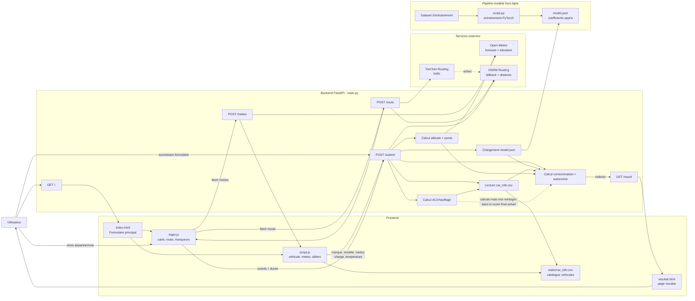
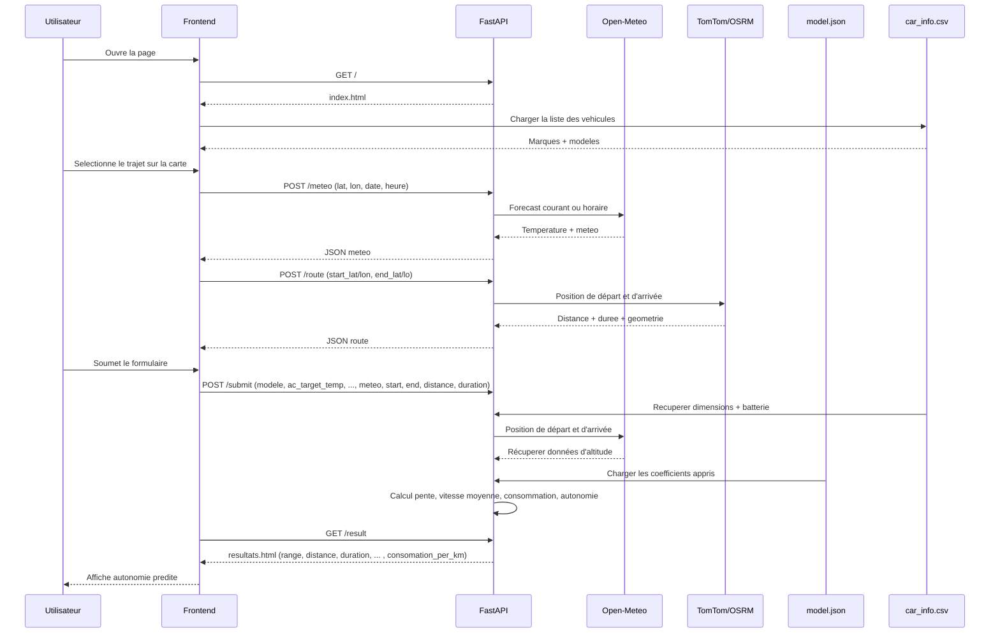

# Diagramme de fonctionnement

Ce document decrit le flux reel de l'application, cote frontend et backend, a partir des fichiers actuellement presents dans le depot.

## Vue d'ensemble

## Sequence principale

