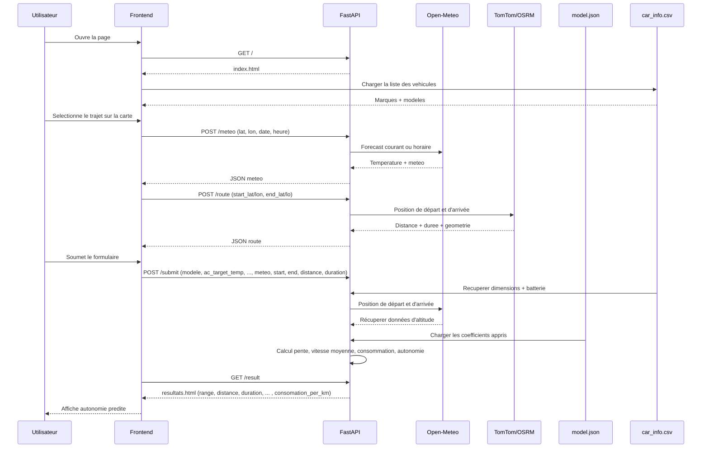

## Diagramme de fonctionnement

```mermaid
sequenceDiagram
    participant User as Utilisateur
    participant UI as Frontend
    participant API as FastAPI
    participant Meteo as Open-Meteo
    participant Route as TomTom/OSRM
    participant Model as model.json
    participant Cars as car_info.csv

    User->>UI: Ouvre la page
    UI->>API: GET /
    API-->>UI: index.html
    UI->>Cars: Charger la liste des vehicules
    Cars-->>UI: Marques + modeles

    User->>UI: Selectionne le trajet sur la carte
    UI->>API: POST /meteo (lat, lon, date, heure)
    API->>Meteo: Forecast courant ou horaire
    Meteo-->>API: Temperature + meteo
    API-->>UI: JSON meteo

    UI->>API: POST /route (start_lat/lon, end_lat/lo)
    API->>Route: Position de départ et d'arrivée
    Route-->>API: Distance + duree + geometrie
    API-->>UI: JSON route

    User->>UI: Soumet le formulaire
    UI->>API: POST /submit (modele, ac_target_temp, ..., meteo, start, end, distance, duration)
    Cars->>API: Recuperer dimensions + batterie
    API->>Meteo: Position de départ et d'arrivée
    Meteo-->>API: Récuperer données d'altitude
    Model->>API: Charger les coefficients appris
    API->>API: Calcul pente, vitesse moyenne, consommation, autonomie
    UI->>API: GET /result 
    API-->>UI: resultats.html   (range, distance, duration, ... , consomation_per_km)
    UI-->>User: Affiche autonomie predite
```

